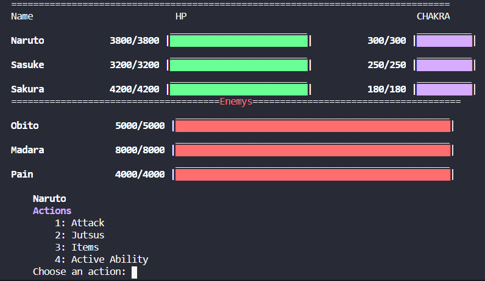

# Naruto Game RPG

 RPG game based on Naruto characters. Originally wrote in Python.

## Project
To start the game, run main.py file. Choose 3 characters, and start to think on your strategies.

## Disclaimer
Original characters and illustrations © Copyright 2002 by Masashi Kishimoto. All rights reserved

## License
This project is licensed under the MIT License. 
see the LICENSE file for details.
